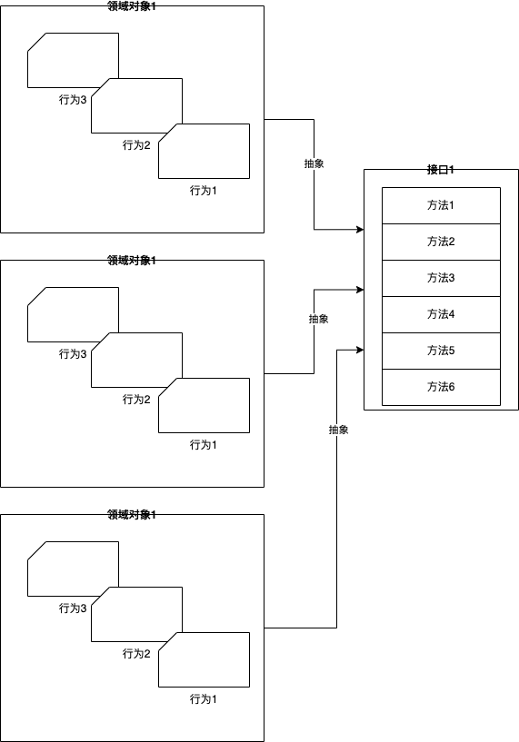

# 接口：接口即契约
## 认识接口类型
接口类型是由 type 和 interface 关键字定义的一组方法集合，其中，方法集合唯一确定了这个接口类型所表示的接口。
```go
type MyInterface interface {
    M1(int) error
    M2(io.Writer, ...string)
}
```
接口类型 MyInterface 所表示的接口的方法集合，包含两个方法 M1 和 M2 为“方法”，更多是从这个接口的实现者的角度考虑的。

方法的参数列表中形参名字与返回值列表中的具名返回值，都不作为区分两个方法的凭据。

下面两个接口类型的定义是等价的：
```go
type MyInterface interface {
    M1(int) error
    M2(io.Writer, ...string)
}

type MyInterface interface {
    M1(n int) error
    M2(w io.Writer, args ...string)
}
```

Go 语言要求接口类型声明中的**方法必须是具名**的，并且**方法名字在这个接口类型的方法集合中是唯一的**。Go 1.14 版本以后，Go 接口类型允许嵌入的不同接口类型的方法集合存在交集，但前提是交集中的方法不仅名字要一样，它的函数签名部分也要保持一致，也就是参数列表与返回值列表也要相同，否则 Go 编译器照样回报错。

比如下面示例中 Interface3 嵌入了 Interface1 和 Interface2，但后两者交集中的 M1 方法的函数签名不同，导致了编译出错：
```go
type Interface1 interface {
    M1()
}

type Interface2 interface {
    M1(string)
    M2()
}

type Interface3 interface {
    Interface1
    Interface2 // 编译报错：duplicate method M1
    M3()
}
```

**在接口类型的方法集合中放入首字母小写的非导出方法也是合法的。**（非导出方法使用频率低）

接口类型一旦被定义后，它就和其他 Go 类型一样可以声明变量，比如：
```go
var err error // err 是一个 error 接口类型的实例变量
var r io.Reader // r 是一个 io.Reader 接口类型的实例变量
```
这些接口类型的变量被称为**接口类型变量**，如果没有被显示赋予初值，接口类型变量的默认值为 nil。如果要为接口类型变量显示赋予初值，我们就要为接口类型变量选择合法的右值。

Go 规定：**如果一个类型 T 的方法集合是某接口类型 I 的方法集合的等价集合或超集，我们就说类型 T 实现了接口类型 I，那么类型 T 的变量就可以作为合法的右值赋值给接口类型 I 的变量**。

如果一个变量类型是空接口类型，由于空接口类型的方法集合为空，这就意味着任何类型都实现了空接口的方法集合，所以我们可以将任何类型的值作为右值，赋值给空接口类型的变量，比如下面的例子：
```go
var i interface{} = 15 // ok
i = "hello, go" // ok
type T struct{}
var t T
i = t // ok
i = &t // ok
```

Go 语言还支持接口类型变量赋值的“逆操作”，也就是通过接口类型变量“还原”它的右值的类型与值信息，这个过程被称为“**类型断言（Type Assertion）**”。
```go
v, ok := i.(T)
```
其中 i 是某一个接口类型变量，如果 T 是一个非接口类型，且 T 是想要还原的类型，那么这句代码的含义就是**断言存储在接口类型变量 i 中的值的类型为 T**。

如果接口类型变量 i 之前被赋予的值确为 T 类型的值，那么这个语句执行后，左侧“comma, ok”语句中的变量 ok 的值将为 true，变量 v 的类型为 T，它的值是之前变量 i 的右值。如果 i 之前被赋予的值不是 T 类型的值，那么这个语句执行后，变量 ok 的值为 false，变量 v 的类型还是那个要还原的类型，但它的值是类型 T 的零值。

类型断言也支持下吗这种语法形式：
```go
v := i.(T)
```
但在这种形势下，一旦接口变量 i 之前被赋予的值不是 T 类型的值，那么这个语句将抛出 panic。如果变量 i 被赋予的值是 T 类型的值，那么变量 v 的类型为 T，它的值就会是之前变量 i 的右值。

通过例子来看一下类型断言的语义：
```go
var a int64 = 13
var i interface{} = a
v1, ok := i.(int64)
fmt.Printf("v1-%d, the type of v1 is %T, ok=%t\n", v1, v1, ok) // v1=13, the type of v1 is int64, ok=true
v2, ok := i.(string)
fmt.Printf("v2-%s, the type of v2 is %T, ok=%t\n", v2, v2, ok) // v2=, the type of v2 is string, ok=false
v3 := i.(int64)
fmt.Printf("v3-%d, the type of v3 is %T\n", v3, v3) // v3=13, the type of v3 is int64
v4 := i.([]int)                                     // panic: interface conversion: interface {} is int64, not []int
fmt.Printf("the type of v4 is %T\n", v4)
```
这段代码中，如果 `v, ok := i.(T)`中的 T 是一个接口类型，那么类型断言的语义就会变成：**断言 i 的值实现了接口类型 T**。入股断言成功，变量 v 的类型为 i 的值的类型，而并非接口类型 T。如果断言失败，v 的类型信息为接口类型 T，它的值为 nil，下面我们在来看一个 T 为接口类型的示例：
```go
type MyInterface interface {
	M1()
}

type T int

func (T) M1() {
	println("T's M1")
}

func main() {
	var t T
	var i interface{} = t
	v1, ok := i.(MyInterface)
	if !ok {
		panic("the value of i is not MyInterface")
	}
	v1.M1()
	fmt.Printf("the type of v1 is %T\n", v1) // the type of v1 is main.T

	i = int64(13)
	v2, ok := i.(MyInterface)
	fmt.Printf("the type of v2 is %T\n", v2) // the type of v2 is <nil>
    // v2 = 13 // cannot use 13 (constant of type int) as type MyInterface in assignment: int does not implement MyInterface (missing M1 method)
}
```
通过 the type of v2 is <nil>，我们其实是看不出断言失败后的变量 v2 的类型的，但通过最后一行代码的编译器错误提示，我们能清晰地看到 v2 的类型信息为 MyInterface。

## 尽量定义小接口
接口类型的背后，是通过把类型的行为抽象成契约，建立双方共同遵守的约定，这种契约将双方的耦合降到了最低的程度。
### 隐式契约，无需签署，自动生效
Go 语言中接口类型与它的实现者之间的关系是隐式的，不需要像其他语言（比如 Java）那样要求实现者显示放置“implements”进行修饰，实现者只需要实现接口方法集合中的全部方法便算是遵守了契约，并立即生效了。

### 更倾向于“小契约”
在代码上尽量定义小接口，即方法个数在 1～3 个之间的接口。

## 小接口有哪些优势
### 第一点：接口越小，抽象程度越高
计算机程序本身就是对真实世界的抽象与再构建。抽象就是对同类事物去除它具体的、次要的方面，抽取它相同的、主要的方面。不同的抽象程度，会导致抽象出的概念对应的事物的集合不同。抽象程度越高，对应的集合空间就越大；抽象程度越低，也就是越具像化，更接近事物真实面貌，对应的集合空间越小。

### 第二点：小接口易于实现和测试

### 第三点：小接口表示的“契约”职责单一，易于复用组合

## 定义小接口，你可以遵循的几点
### 首先，别管接口大小，先抽象出接口。
要设计和定义接口，前提是需要先有接口。

专注于接口是编写强大而灵活的 Go 代码的关键。因此，在定义小接口之前，我们需要先针对问题领域进行深入理解，聚焦抽象并发现接口，就像下图展示的那样，先针对领域对象的行为进行抽象，形成一个接口集合：



**初期，我们先不要介意这个接口集合中方法的数量**，因为对问题的理解是循序渐进的，在第一版代码中直接定义出小接口可能并不现实。

### 第二，将大接口拆分为小接口。
有了接口后，我们就会看到接口被用在了代码的各个地方。一段时间后，我们就来分析哪些场合使用了接口的哪些方法，是否可以将这些场合使用的接口的方法提取出来，放入一个新的小接口中，就像下图中那样：


这张图中的大接口 1 定义了多个方法，一段时间后，我们发现方法 1 和方法 2 经常用在场合 1 中，方法 3 和 方法 4 经常用在场合 2 中，方法 5 和 方法 6 经常用在场合 3 中，大接口 1 的方法呈现出一种按业务逻辑自然分组的状态。

这个时候我们可以将这三组方法分别提取出来放入三个小接口中，也就是将大接口 1 拆分为三个小接口 A、B、C。拆分后，原应用场合 1~3 使用接口 1 的地方就可以无缝替换为接口 A、B、C 了。

### 最后，我们要注意接口的单一契约职责。

## 小结
某接口类型定义中嵌入不同接口类型的方法集合若存在交集，交集中的方法不仅名字要一样，函数签名也要相同。
对接口类型和非接口类型进行类型断言的语义是不完全相同的。

Go 接口背后的本质是一种“契约”，通过契约我们可以将代码双方的耦合降至最低。Go 惯例上推荐尽量定义小接口，一般而言接口方法集合中的方法个数不要超过三个，单一方法的接口更受 Go 社区青睐。

小接口有诸多优点，比如，抽象程度高、易于测试与实现、与组合的设计思想一脉相承、鼓励你编写组合的代码，等等。