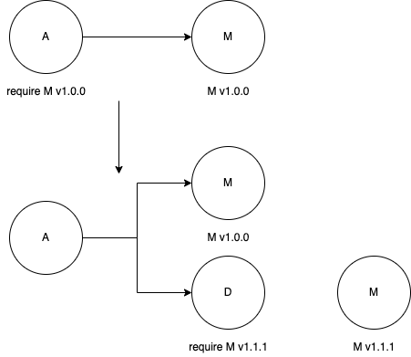

主要解决两个重要的问题：
- 准确地记录项目依赖；
- 可重复的构建。

## 1. Go Module 基础
### 1. module 的定义
A module is a collection of related Go packages that are versioned together as a single unit.
定义非常清晰，一组 package 的集合，一起被标记版本，即一个 module。

通常而言，一个仓库包含一个 module（虽然也可以包含多个，但不推荐），所以仓库、module 和 package 的关系如下：
- 一个仓库包含一个或多个 module；
- 每个 module 包含一个或多个 package；
- 每个 package 包含一个或多个源文件。

此外，一个 module 的版本号规则必须遵循语义化规范，版本号必须使用 `v(major).(minor).(patch)` 格式，比如 v0.1.0、v1.2.3 或 v1.5.0-rc.1。

### 2. 语义化版本规范
版本格式 `v(major).(minor).(patch)` 中的 major 指的是大版本，minor 指小版本， patch 指补丁版本。
- major： 当发生不兼容的改动时才可以增加该版本，比如 `v2.x.y` 与 `v1.x.y`是不兼容的；
- minor： 当有新增特性时才可以增加该版本，比如 `v1.17.0` 是在 `v1.16.0` 的基础上增加了新的特性，同时兼容 `v1.16.0`；
- patch： 当有 bug 修复时才可以增加该版本，比如 `v1.17.1` 修复了 `v1.17.0` 上的 bug，没有增加新特性。 

## 2. 快速实践
### 1. Hello World
```go
package main

import "fmt"

func main() {
    fmt.Println("Hello Wrold")
}
```

### 2. 初始化 module
如果一个项目要使用 Go Module，那么其本身需要先成为一个 module，即需要一个 module 名字。

在 Go Module 机制下，项目的 module 名字及其依赖信息记录在一个名为 go.mod 的文件中，该文件可以手动创建，也可以使用`go mod init`命令自动生成。

命令格式为 `go mod init [module]`，其中 `[module]` 为 module 名字，如果不填，则 `go mod init` 会尝试从版本控制系统或 import 的注释中猜测一个。这里推荐指定明确的 module 名字，因为猜测有时需要一些额外的条件。

module 的名字用于 import 语句中，如果 module 中包含多个 package，那么 module 的名字为 package 的前缀。

### 3. 管理依赖
```go
package main

import (
    "fmt"

    "github.com/google/uuid"
)

func main() {
    id := uuid.New().String()
    fmt.Println("UUID: ", id)
}
```
在开始编译前，我们先使用 `go get` 来下载依赖包， `go get`会自动分析并下载依赖包。

经 `go get` 修改的 go.mod 和创建的 go.sum 都需要提交到代码库，这样别人获取项目代码后，在编译时就会使用项目所要求的依赖版本。

如果之前没有使用`go get`命令下载过依赖，使用`go build main.go`命令时，依赖包也会被自动下载，并且也会自动更新 go.mod 文件。

### 4. 版本间差异
### 5. 后记

## 3 replace 命令
go.mod 文件中通过指令声明 module 信息，用于控制 Go 命令行工具进行版本选择。一共有四个指令可供使用：
- module：声明 module 的名称；
- require：声明依赖及其版本号；
- replace：替换 require 中声明的依赖，使用另外的依赖及其版本号；
- exclude：禁用指定的依赖。

### 1. replace 的工作机制
顾名思义，replace 指替换，它用于替换 require 指令中出现的包。例如，我们使用 require 指定一个依赖：
```
module github.com/mangolau/gomodule

go 1.18

require github.com/google/uuid v1.3.0
```

此时可以使用 `go list -m all` 命令查看最终选定的版本。
```shell
$ go list -m all
github.com/mangolau/gomodule
github.com/google/uuid v1.3.0
```
毫无意外，最终选定的 uuid 版本正是我们在 require 中指定的 v1.3.0。

replace 用于替换 require 中出现的包，它正常工作还需要满足以下两个条件：
- replace 仅在当前 module 为 main module 时有效，比如我们当前在编译 github.com/mangolau/gomodule，此时就是 main module，如果其他项目引入了 github.com/mangolau/gomodule，那么其他项目编译时，此处的 replace 就会被自动忽略。
- replace 指令中“=>”前面的包及其版本号必须出现在 require 中才有效，否则指令无效，也会被忽略。

### 2. replace 的使用场景
#### 1）替换无法下载的包
#### 2）调试依赖包
有时我们需要调试依赖包
#### 3）使用 fork 仓库
有时在使用开源的依赖包时发现了 bug，在开源版本还未修改或没有新的版本发布时，可以使用 fork 仓库，在 fork 仓库中进行 “bug fix”。可以在 fork 仓库上发布新的版本 v1.3.1，此时使用 fork 仓库的项目的 go.mod 文件中的 replace 部分可以相应地做如下修改：
```
github.com/google/uuid v1.3.0 => github.com/mangolau/uuid v1.3.1
```
需要说明的是，使用 fork 仓库仅仅是临时的做法，一旦开源版本变得可用，则需要尽快切换到开源版本。

#### 4）禁止被依赖

## 4 exclude 指令
go.mod 文件中的 exclude 指令用于排除某个包的特定版本，其与 replace 类似，也仅在当前 module 为 main module 时有效，其他项目引用当前项目时，exclude 指令会被忽略。

exclude 指令在实际项目中很少被使用，因为很少会显式地排除某个包的某个版本，除非我们知道某个版本有严重的 bug。

### 1. 排除指定版本
### 2. 创建依赖包
### 3. 使用依赖包

## 5 indirect 指令
在使用 Go Module 的过程中，随着引入的依赖增多，细心的读者也许会发现 go.mod 文件中部分依赖包后面会出现一个 “// indirect”的标识。这个标识总是出现在 require 指令中，其中 “//” 与代码的行注释一样表示注释的开始，“indirect”表示间接的依赖。

在执行命令 `go mod tidy`时，Go Module 会自动整理 go.mod 文件，如果有必要则会在部分依赖包的后面增加“// indirect” 注释。被添加 indirect 注释的依赖包说明该依赖包被间接引用，而没有添加“// indirect”注释的依赖包则是被直接引用的，即明确地出现在某个 import 语句中。

这里需要强调的是：不是所有的间接依赖都会出现在 go.mod 文件中。

间接依赖出现在 go.mod 文件中的情况，可能符合下面所列场景的一种或多种：
- 直接依赖未启用 Go Module；
- 直接依赖 go.mod 文件中缺失的部分依赖。

### 1. 直接依赖未启用 Go Module

### 2. 直接依赖 go.mod 文件不完整

### 3. 小结
#### 1）为什么要记录间接依赖
我们知道 Go Module 需要精确地记录软件的依赖情况，虽然此处记录了依赖 B 的版本号，但 B 的依赖情况没有记录下来，所以如果 B 的 go.mod 文件缺失了（或没有）这个信息，则需要在 A 的 go.mod 文件中记录下来。此时间接依赖的版本号会根据 Go Module 的版本选择机制确定一个最有版本。

#### 2）如何处理间接依赖
可以通过使用依赖的新版本或替换依赖的方式消除间接依赖。

#### 3）如何查找间接依赖来源
Go Module 提供了 `go mod why`命令来解释为什么会依赖某个软件包，如果要查看 go.mod 中某个间接依赖是被哪个依赖引入的，则可以使用`go mod why -m <pkg>`命令来查看。

## 版本选择机制
在前面的章节中，我们使用`go get <pkg>`来获取某个依赖，如果没有特别指定依赖的版本号，则`go get`会自动选择一个最优版本，如果本地有 go.mod 文件，那么还会自动更新 go.mod 文件。

事实上除了`go get`，`go build`和`go mod tidy`也会自动帮我们选择依赖的版本。这些命令在选择依赖版本时都遵循一定的规则。

### 1. 依赖包版本约定
#### 1）Go Module 之前版本的兼容性
#### 2）Go Module 之后版本的兼容性
- 如果新 package 和旧的 package 拥有相同的 import 路径，那么新 package 必须兼容旧的 package；
- 如果新的 package 不能兼容旧的 package，那么新的 package 需要更换 import 路径。

在 Go Module 时代，module 版本号要遵循语义化版本规范，即版本号格式为 `v<major>.<minor>.<patch>`，如 v1.2.3。当有不兼容的改变时，需要增加 major 版本号，如 v2.1.0。

Go Module 规定，如果 major 版本号大于 1，则 major 版本号需要显式地标记在 module 名字中，如`module github.com/my/mod/v2`。这样做的好处是 Go Module 会把 `module github.com/my/mod/v2`和`module github.com/my/mod`视作两个 module，它们甚至可以被同时引用。

另外，如果 module 的版本为 v0.x.x 或 v1.x.x，则都不需要在 module 名字中体现版本号。

### 2. 版本选择机制
Go 的多个命令行工具都具有自动选择依赖版本的能力，如 `go build` 和 `go test`，当在源代码中增加了新的 import 后，这些命令会自动选择一个最优的版本，并更新 go.mod 文件。

需要特别说明的是，如果 go.mod 文件中已标记了某个依赖包的版本号，则这些命令不会主动更新 go.mod 中的版本号。所谓自动更新版本号只在 go.mod 中缺失某些依赖或依赖不匹配时才会发生。

#### 1）最新版本选择
在源代码中新增加一个 import，比如：
```go
import "github.com/RainbowMango/M"
```
如果 go.mod 的 require 指令中并没有包含 github.com/RainbowMango/M 这个依赖，那么 go build 或 go test 命令则会去 github.com/RainbowMango/M 仓库中寻找最新的符合语义化版本规范的版本，如 v1.2.3，并在 go.mod 文件中增加一条 require 依赖：
```go
require github.com/RainbowMango/M v1.2.3
```
这里，由于 import 路径里没有类似于 v2 或更高的版本号，所以版本选择时只会选择 v1.x.x 的版本，不会选择 v2.x.x 或更高的版本。

#### 2）最小版本选择


module A 依赖 module M 的 1.0.0 版本，但之后 module A 引入了 module D，而 module D 依赖 module M 的 1.1.1 版本，此时，由于依赖的传递，module A 也会选择 1.1.1 版本。

需要注意的是，此时会自动选择最小可用的版本，而不是最新的 tag 版本。

### 3. 小结

## 7. incompatible
### 1. 能否引用不兼容的包
对于使用不规范模块的项目来讲，在不规范模块后面增加 +incompatible（不兼容）标识并不影响使用。

但是从 Go1.14起，如果不规范模块中也包含 go.mod 文件（说明其已支持 Go Module），那么其他项目在使用这个不规范模块时， go get 将不会自动选择不兼容的版本（即版本号大于 v2.0.0）。这也体现了 Go 官方对于不规范模块的消极态度。

### 2. 如何处理 incompatible

## 8. 伪版本
### 1. 什么是伪版本
在实际项目中，有时不得不直接使用一个 commit ID，比如某项目发布了 v1.5.0，但随即又修复了一个 bug（引入一个新的 commit ID），而且没有发布新的版本。此时，如果我们希望使用最新的版本，则需要直接引用最新的 commit ID，而不是之前的语义化版本 v1.5.0。使用 commit ID 的版本在 Go 语言中成为 pseudo- version，可译为“伪版本”。

伪版本的版本号通常会使用  vx.y.x-yyyymmddhhmmss-abcdefabcdef 格式，其中 vx.y.x 看上去像是一个真实的语义化版本，但通常并不存在该版本，所以称为伪版本。另外 abcdefabcdef 表示某个 commit ID 的前 12 位，而 yyyymmddhhmmss 表示该 commit 的提交时间，方便进行版本比较。

使用 伪版本的 go.mod 的例子如下：
```
...
require (
    go.etcd.io/etcd v0.0.0-20191023171146-3cf2f69b5738
)
...
```

### 2. 伪版本风格
伪版本格式都为 vx.y.x-yyyymmddhhmmss-abcdefabcdef，但 vx.y.z 部分在不同情况下略有区别，有时可能是 vx.y.x-pre.0 或 vx.y.z-0，甚至是vx.y.z-dev.2.0 等。

vx.y.z 的具体格式取决于引用 commit ID 之前的版本号，如果引用 commit ID 之前最新的 tag 版本为 v1.5.0，那么伪版本号在其基础上增加一个标记，即 v1.5.1-0，看上去像是下一个版本一样。

实际使用中 go 命令会帮助我们自动生成伪版本，不需要手动计算，所以此处我们仅做基本说明。

### 3. 如何获取伪版本
go get github.com/mangolau/gomodule@commitId

## 9. 依赖包存储
在 GOPATH 模式下，依赖包存储在 $GOPATH/src 下，该目录下只保存特定依赖包的一个版本，而在 GOMODULE 模式下，依赖包存储在 $GOPATH/pkg/mod 下，该目录下可以存储特定依赖包的多个版本。

需要注意的是， $GOPATH/pkg/mod 目录下有一个 cache 目录，它用来存储依赖包的缓存，简单来说，go 命令每次下载新的依赖包都会在该 cache 目录中保存一份。

### 1. GOPATH 依赖包存储
### 2. GOMODULE 依赖包存储
相较于 GOPATH 模式，GOMODULE 有两处不同点：
- 依赖包的目录中包含了版本号，每个版本占用一个目录；
- 依赖包的特定版本目录中只包含依赖包文件，不包含 .git 目录。

### 3. 包名大小写敏感问题

## 10. go.sum
### 1. go.sum 文件记录
go.sum 文件中的每行记录由 module 名、版本和 Hash 值组成，并由空格分开：
```
<module> <version> [/go.mod] <hash>
```

比如：
```
github.com/google/uuid v1.3.0 h1:t6JiXgmwXMjEs8VusXIJk2BXHsn+wx8BZdTaoZ5fu7I=
github.com/google/uuid v1.3.0/go.mod h1:TIyPZe4MgqvfeYDBFedMoGGpEw/LqOeaOT+nhxU+yHo=
```

正常情况下，每个依赖包版本会包含两条记录，第一条记录为该依赖包版本整体（所有文件）的 Hash 值，第二条记录仅表示该依赖包版本中 go.mod 文件的 Hash 值，如果该依赖包版本没有 go.mod 文件，则只有第一条记录。

### 2. 生成
假设在开发某个项目时，在 GOMODULE 模式下引入一个新的依赖，通常会使用 go get 命令获取该依赖。

go get 命令首先会将该依赖包下载到本地缓存目录 $GOPATH/pkg/mod/cache/download 中，该依赖包是一个后缀为 .zip 的压缩包，如 v1.0.0.zip。go get 下载完成后会对该 .zip 包做 Hash 运算，并将结果存放在后缀为 .ziphash 的文件中，如 v1.0.0.ziphash。如果在项目的根目录中执行 go get 命令，那么 go get 还会同步更新 go.mod 和 go.sum 文件， go.mod 中记录的是依赖名及其版本。

go.sum 文件中则会记录依赖包的 Hash 值（同时还有依赖包中 go.mod 的 Hash 值）

值的一提的是，在更新 go.sum 之前，为了确保下载的依赖包是真实可靠的， go 命令在下载完依赖包后还会咨询 GOSUMDB 环境变量所指示的服务器，以得到一个权威的依赖包版本的 Hash 值。如果 go 命令计算出的依赖包版本的 Hash 值 与 GOSUMDB 服务器给出的 Hash 值不一致，那么 go 命令将拒绝向下执行，也不会更新 go.sum 文件。

go.sum 存在的意义在于，我们希望别人或者在别的环境中构建项目时所使用依赖包必须跟 go.sum 中记录的是完全一致的，从而达到一致构建的目的。

### 3. 校验
假设我们拿到某项目的源代码并尝试在本地构建，go 命令会从本地缓存中查找所有 go.mod 中记录的依赖包，并计算本地依赖包的 Hash 值，然后与 go.sum 中的记录进行对比，即检测本地缓存中使用的依赖包版本是否满足项目 go.sum 文件的期望。

如果校验失败，则说明本地缓存目录中依赖包版本的 Hash 值和项目的 go.sum 中记录的 Hash 值不一致，go 命令将拒绝构建。这就是 go.sum 存在的意义，即如果不使用期望的版本，就不能构建。

当校验失败时，有必要确认到底是本地缓存错了，还是 go.sum 记录错了。需要说明的是，二者都可能出错，本地缓存目录中的依赖包版本有可能被有意或无意地修改过，go.sum 中记录的 Hash 值也可能被篡改过。

当校验失败时，go 命令倾向于相信 go.sum，因为一个新的依赖包版本在被添加到 go.sum 前是经过 GOSUMDB （校验和数据库）验证过的。此时即便系统中配置了 GOSUMDB （校验和数据库），go 命令也不会查询该数据库。

### 4. 校验和数据库
环境变量 GOSUMDB 标识一个 checksum database，即校验和数据库，实际上是一个 Web 服务器，该服务器提供查询依赖包版本的 Hash 值的服务。

该数据库中记录了很多依赖包版本的 Hash 值，比如 Google 官方的 sum.golang.org 记录了所有可公开获得的依赖包版本。除了使用官方的数据库，还可以指定自行搭建的数据库，甚至干脆禁用它（export GOSUMDB=off）。

如果系统配置了 GOSUMDB，那么在依赖包版本被写入 go.sum 之前会向该数据库查询该依赖包版本的 Hash 值进行二次校验，校验无误后再写入 go.sum。

如果系统禁用了 GOSUMDB，那么在依赖包版本被写入 go.sum 之前不会进行二次校验，go 命令会相信所有下载到的依赖包，并把其 Hash 值记录到 go.sum 中。

## 11 模块代理
### 1. 什么是 GOPROXY
Go 团队提供的模块镜像服务。该服务通过缓存公开获得的模块来为 Go 开发者服务，该服务实际上充当了众多版本控制系统的代理。

go 命令通过环境变量 GOPROXY 读取镜像服务器地址，该变量默认指向官方的镜像服务器。

```
mangolau$ go env
...
GOPROXY="https://goproxy.cn,direct"
...
```

Go 自 1.13 版本起支持配置多个用逗号分隔的镜像服务器地址，使用 go 命令下载模块时会依次从各镜像服务器下载，直到下载成功为止，行尾的 direct 表示如果前面的镜像服务器没有指定的模块则从源地址下载。

注意，go 命令依次请求 GOPROXY 列出的服务器时，如果代理服务器无法响应（HTTP 返回码为 404、410 除外），那么将不再继续尝试后续的代理服务器。

### 2. 代理协议

#### 1）获取模块列表

#### 2）获取模块元素数据

#### 3）获取 go.mod 文件

#### 4）获取代码压缩包

#### 5）获取模块的最新可用版本

#### 6）下载过程

### 3. 观察下载步骤
使用 go mod download 命令观察请求代理服务器的信息

### 4. 小结

## 12 GOSUMDB 的工作机制

### 1. 环境变量

### 2. 引入 GOSUMDB 的背景
#### 1）正确的模块版本

#### 2）go.sum 的不足

### 3. GOSUMDB 的工作机制
#### 1） GOSUMDB 是什么
校验和数据库通过存储模块版本的 Hash 值，相当于给该模块版本提供了公证服务，任何人来查都能得到相同的 Hash 值。

#### 2）校验流程
- 一是模块被下载后，go 命令会对下载的模块做 Hash 运算，然后与校验和数据库中的数据进行对比，以此来确保下载的模块是合法的。
- 二是模块 Hash 值被添加到 go.sum 文件之前，go 命令对缓存在本地的模块做 Hash 运算，然后与校验和数据库中的数据进行对比，以此来确保本地的模块没有被篡改。

#### 3）数据库数据来源

## 13 GOSUMDB 的实现原理

## 14 第三方代理
### 1. 模块代理
#### 1）配置第三方代理

#### 2） 可用的第三方代理
- goproxy.io（开源项目），国内最早的代理服务；
- goproxy.cn（开源项目），目前有七牛云提供服务；
- mirrors.tencent.com/go，由腾讯云提供服务；
- mirrors.aliyun.com/goproxy，由阿里云提供服务。

### 2. 检验和数据库代理

### 3. 安全性

## 15 私有模块

### 1. 私有模块配置
环境变量 GOPRIVATE 是 1.13 版本才引入的变量，用于指定私有模块的前缀（支持通配符），多个模块前缀间使用逗号分隔：
```
GOPRIVATE="*.corp.example.com,rsc.io/private"
```
按照此配置，go 命令将把所有拥有这些前缀的模块都视为私有，不会从代理服务器下载代码，也不会使用校验服务器来检查下载的代码。比如模块 git.corp.example.com/xyzzy 、 rsc.io/private 、 rsc.io/private/quux 都将视为私有。

### 2. 私有代理场景

## 16 Go Module 的演进
### 1. Go 1.11
### 2. Go 1.12
### 3. Go 1.13
### 4. Go 1.14
### 5. Go Module 时间