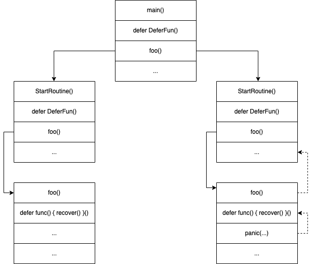

## 工作机制
### 1。 recover() 函数
```go
func recover() interface{}
```
recover() 函数的返回值就是 panic() 函数的参数，当程序产生 panic 时，recover() 函数就可用于消除 panic，同时返回 panic() 函数的参数，如果程序没有发生 panic，则 recover() 函数返回 nil。

如果 panic() 函数参数为 nil，那么仍然是一个有效的 panic，此时 recover()函数仍然可以捕获 panic，但返回值为 nil。如以下代码所示，由于 err 为 nil，所以字符串 A 得不到打印，panic 可以被消除：
```go
func RecoverDemo6() {
	defer func() {
		if err := recover(); err != nil {
			fmt.Println("A")
		}
	}()

	panic(nil)
	fmt.Println("B")
}
```
此外，recover() 函数必须且直接位于 defer 函数中才有效，比如下面的函数就无法捕获 panic：
```go
func RecoverDemo3() {
	defer func() {
		func() { // recover 在 defer 嵌套函数中无效
			if err := recover(); err != nil {
				fmt.Println("A")
			}
		}()
	}()

	panic("demo")
	fmt.Println("B")
}
```

### 2.工作流程


上面的流程图中实线箭头代表程序正常执行流程，虚线箭头代表 panic 执行流程。程序启动了两个协程，某协程中函数 foo() 产生了 panic，并且在 foo() 函数中成功捕获了该 panic，程序流程将转到上游函数中继续执行，上游函数 StartRoutine() 感知不到 panic 的发生。

### 3. 小结
- recover() 函数调用必须要位于 defer 函数中，且不能出现在另一个嵌套函数中；
- recover() 函数成功处理异常后，无法再次回到本函数发生 panic 的位置继续执行；
- recover() 函数可以消除本函数产生或收到的 panic，上游函数感知不到 panic 的发生。

当函数中发生 panic 并用 recover() 函数恢复后，当前函数仍然会继续返回，对于匿名返回值，函数将返回相应类型的零值，对于具名返回值，函数将返回当前已经存在的值。